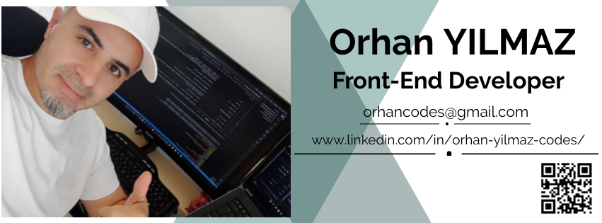

Join me on my coding and learning journey!

<h1 align="center"> # Hello, I'm Orhan YILMAZ! 👋

<h3  align center =" >Front-End Developer</h3>

I am a Front-End Developer. I am passionate about creating user-friendly and engaging web applications. My favorite programming languages are Java and JavaScript.

  
  
&nbsp

  
- 💼 I am currently working on a Bank Mobile Application.
- 🌱 I’m currently learning Python.
- 👯 I’m open to collaborating on new projects and opportunities.
- 💬 Ask me about JAVA, JAVASCRIPT, HTML, REACT, REDUX, CSS, SASS, BOOTSTRAP, DOCKER, AWS, NEXT.JS, GIT.
- 📫 Bana Ulaşın

 <h3 align="left">Connect with me:</h3>

  

   
&nbsp

<!DOCTYPE html>
<html lang="en">
<head>
    <meta charset="UTF-8">
    <meta name="viewport" content="width=device-width, initial-scale=1.0">
    <title>Orhan YILMAZ</title>
    
</head>
<body>
    

        <h1>Merhaba, ben Orhan YILMAZ! 👋</h1>
        
        
Ben bir <strong>Front-End Geliştiricisiyim</strong>. Kullanıcı dostu ve ilgi çekici web uygulamaları oluşturma konusunda tutkuluyum. En sevdiğim programlama dilleri <strong>Java</strong> ve <strong>JavaScript</strong>'tir.

        
        
        
        <h2>💼 Şu Anda Çalıştığım Proje</h2>
        
Şu anda <strong>Banka Mobil Uygulaması</strong> üzerinde çalışıyorum. Bu proje, kullanıcı dostu bir mobil bankacılık deneyimi sunmayı amaçlamaktadır.

        
        <h2>🌱 Öğrendiğim Teknolojiler</h2>
        
Şu anda <strong>Python</strong> öğreniyorum. Öğrenme sürecimde ilerledikçe yeni projeler ve teknolojiler üzerinde çalışmaktan büyük keyif alıyorum.

        
        <h2>🤝 İş Birliği</h2>
        
Yeni projelerde ve fırsatlarda iş birliğine açığım. Eğer ilginç projeler üzerinde çalışıyorsanız veya iş birliği yapmak istiyorsanız, bana <a href="mailto:orhancodes@gmail.com">e-posta</a> veya <a href="https://www.linkedin.com/in/orhan-yilmaz-kodlari/">LinkedIn</a> üzerinden ulaşabilirsiniz.

        
        <h2>💬 Bana Sorabileceğiniz Konular</h2>
        <ul>
            <li>JAVA</li>
            <li>JAVASCRIPT</li>
            <li>HTML</li>
            <li>REACT</li>
            <li>REDUX</li>
            <li>CSS</li>
            <li>SASS</li>
            <li>BOOTSTRAP</li>
            <li>DOCKER</li>
            <li>AWS</li>
            <li>NEXT.JS</li>
            <li>GIT</li>
        </ul>
        
        <h2>📫 Bana Ulaşın</h2>
        
E-posta: <a href="mailto:orhancodes@gmail.com">orhancodes@gmail.com</a> 
        LinkedIn: <a href="https://www.linkedin.com/in/orhan-yilmaz-kodlari/">Orhan Yılmaz</a>

        
        <h2>🔗 Bağlantılar</h2>
        <ul>
            <li><a href="https://github.com/orhancodes">GitHub Profilim</a></li>
        </ul>
    

</body>
</html>

<h3 align="left">Languages and Tools:</h3>

  
     

 
   
  
  
  
     
   
  
     
   
&nbsp

  

 
&nbsp

  

 
&nbsp

 

 
&nbsp

&nbsp;

 
&nbsp

 

    
  

 

  </li>
</ul>
